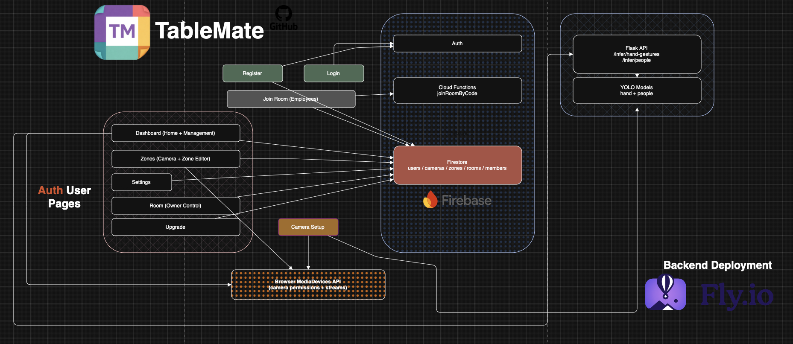
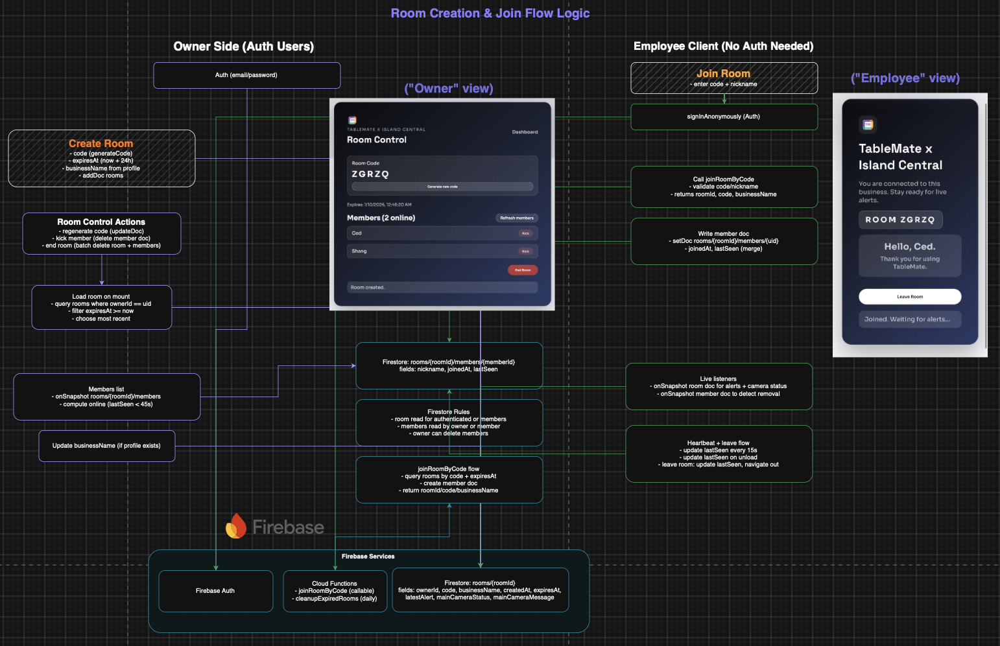

# TableMate x Github
Discover a new way to manage your business.

  

 **Report Issues/Feature Requests:** https://github.com/pokecedgo/TableMate/discussions

 **TableMate Website:** https://tablemate.work

**TableMate Ultimate Guide**
https://www.youtube.com/watch?v=anDzsKTFFCI
---

  
  

***The Story Behind TableMate***

While dining in the corner of a small restaurant in Jersey, I watched the space go from empty into a full
house - over 30 people packed into a tight floor. Like many busy small businesses, this
restaurant was experiencing a major rush while trying to maximize profits by juggling
dine-in service alongside multiple delivery platforms. I happened to be seated near the
delivery pickup area and quickly noticed something striking: only two employees were
managing everything. They were serving tables, preparing online orders, and coordinating
with delivery drivers all at once. Drivers waited for food, customers stood at the register
making eye contact for five minutes or more, and tables needed attention - not because the
staff didn't care, but because they simply couldn't see everything at once. That moment
revealed a common challenge for modern small businesses operating at full capacity.
TableMate was born from that realization: a virtual second set of eyes designed to help
teams stay aware, responsive, and efficient during peak moments.

## V1 (Beta) Update Log
- Multi-camera monitoring with per-camera zones
- Table and door zones for in-restaurant coverage
- Hand-gesture detection for customer assistance alerts
- People counting and live alert feed
- Table management timers for dine-in tracking
- Room control for staff device coordination
- Owner + employee views with real-time updates

## Initial Project Design
https://drive.google.com/file/d/1JVNOImLmwKWfekDwv7iN0JJCTQchAh33/view?usp=share_link

## Why use TableMate in your business?
---
Need a bathroom break? TableMate keeps watch and alerts you the moment someone walks in using our **Room Feature.** A way to connect any amount of devices, whether a work tablet or your personal phone, to the TableMate application.

Busy rush with and the business is getting orders from UberEats & Doordash but there's only 2 employees on the floor? TableMate flags **hand‑raise detection** help customers be priotized at all times so no table gets missed and your business maintains that high rating review!

Working the register while delivery pickups pile up? TableMate helps you prioritize who needs you next and alerts customers that enters/leaves the door with **Door Detection**.

Blind spots in the dining room and don't want to risk customers waiting too long? TableMate covers the areas you can’t see from the counter. Use TableMate's **Dine Tracker** to track how long customers have been dining.

---

## Recommended Camera Setup
(TableMate allows usage of 1 Camera up to 8 Cameras)
- **Single camera setup:** Mount the camera in a high, fixed position with a wide view of the dining floor. Aim to capture every table clearly with minimal obstructions.
- **Multiple rooms or blocked sightlines:** If walls or layout prevent one camera from seeing all tables, add additional cameras. Each camera can have its own zone setup so every area is covered.
- **Avoid blind spots:** Check corners, booths, and areas behind partitions. If a table can’t be seen clearly, add a second angle.
- **Stable placement:** Use a fixed mount (tripod, wall mount, shelf) to prevent the camera from shifting during busy hours.
- **Lighting matters:** Place cameras where lighting is consistent and avoid direct glare from windows or overhead lights to improve detection accuracy.

## Zone Creation (How To)
1. Open the Zone Editor and select your active camera.
2. Click “Draw Zone” and choose the zone type (Table or Door).
3. Draw the shape on the camera feed, name the zone, and save.
4. Repeat for each camera so every table and entry point is covered.

**Table Zones**
- Used to map each table’s position.
- Hand-raise detections inside a table zone trigger assistance alerts that mention the table name.
- Table zones also power table timers in Management mode.

**Door Zones**
- Used to mark entry/exit points.
- People detections that overlap a door zone trigger “Customer entered/left” alerts.
- Great for staff awareness when the dining room is quiet or understaffed.

## Room Creation (How To)
1. Go to Room Control and create a room (one active room per owner).
2. Share the generated room code with staff.
3. Staff joins via “Join Room” and enters their nickname.
4. Members appear in the owner’s list; you can refresh or remove them.
5. End the room to disconnect all staff devices.

## Free Vs. TableMate+

## Management Mode
Management mode is the live ops view:
1. **Camera:** see active feeds and check camera health.
2. **Alerts:** view hand-raise and door alerts in real time.
3. **Tables:** run dine‑in timers for each table zone.

Use it during service to keep responses fast and prevent missed tables.

## Alerts & Notifications
Alerts trigger when:
- A hand gesture is detected inside a **Table zone**.
- A person is detected overlapping a **Door zone**.

Alerts can be reviewed by owners and staff (via Room), and are designed to be quick, visible, and actionable.

## Settings
Settings lets you:
- Update business name and profile details.
- Configure alert preferences and visual options.
- Manage plan status (Free vs. TableMate+).
- Reset camera setup if your hardware changes.
---

### Architecture

### Stack
- **Frontend:** React + Vite + TypeScript
- **Backend:** Python (Flask) + Ultralytics YOLO
- **Database:** Firebase Firestore
- **Auth:** Firebase Authentication (Email/Password, Google)
- **Realtime + Jobs:** Firebase Cloud Functions (callable) + scheduled cleanup
- **Hosting:** Firebase Hosting (frontend) + Fly.io (backend)

### APIs & Services Used
- **Firebase Auth:** account creation, login, password reset
- **Firestore:** rooms, members, users, zones, settings
- **Cloud Functions (callable):** joinRoomByCode
- **Cloud Functions (scheduled):** cleanupExpiredRooms
- **YOLO Inference API (self-hosted):** /infer/hand-gestures, /infer/people
- **YouTube Embed:** onboarding tutorial video

## Resources
- Ultralytics YOLO: https://docs.ultralytics.com
- Roboflow: https://roboflow.com
- Driver.js (guided tours): https://driverjs.com
- Firebase: https://firebase.google.com
- Fly.io: https://fly.io

---
## Custom Trained Models: Few Samples
Camera used for training: EMEET SmartCam w/ Tripod 

 
 
 
---
## Project Timeline (Dec 4 - Jan 15)

I traveled back and forth throughout Dec-Jan to the (1 hour away) Island Central restaurant for application testing & model training. Live training was pivotal for the application efficiency so a majority of issues came up when testing (debugging). When back home, I trained hand gesture detection while also working/polishing the website flow and backend integration with firebase and (initially Roboflow but eventually used localized training for token purposes) Table/people detection were testing at the restaurant to ensure various angles and distances were into consideration for the YOLO model.

**Week 1 (Dec 4-10): Foundation + discovery**
- Defined product vision and core workflows (Zones, Alerts, Rooms, Management).
- Set up repo structure, frontend scaffold, backend API skeleton, Firebase project.
- Initial UI exploration and data model planning for zones, cameras, rooms.

**Week 2 (Dec 11-17): Core UI + auth + rooms**
- Built main pages (Home/Dashboard, Zones, Join Room, Room Panel).
- Implemented Firebase auth + Firestore reads/writes.
- Created room creation/join flow and member tracking.

**Week 3 (Dec 18-24): Camera + zones + detection wiring**
- Camera setup flow, device selection, permissions, and preview.
- Zone creation/editing for tables and doors.
- Connected inference endpoints and started hand-gesture detection flow.
- Traveled back and forth to Island Central (Jersey City) to gather fixed-environment data for table/gesture training.

**Week 4 (Dec 25-31): Alerts + notifications + iteration**
- Notification system + flashing alerts.
- Door zone alerts + cooldown logic.
- UX refinements based on real testing.
- Continued on-site data collection at Island Central to refine gesture/table detection.

**Week 5 (Jan 1-7): Multi-camera + stability + styling**
- Added multi-camera management (add/remove, per-camera zones).
- Improved data persistence and handling of disconnected cameras.
- Visual overhaul: modern dashboard layout, refined cards, typography, and branding.
- Additional Island Central visits to validate detection in the real environment.

**Week 6 (Jan 8-15): Deployment + polish + documentation**
- Deployed frontend + backend, fixed CORS/runtime issues.
- Added guided UI elements, updated copy, and mobile fixes.
- Documentation: architecture diagrams, README, tutorial video integration.
