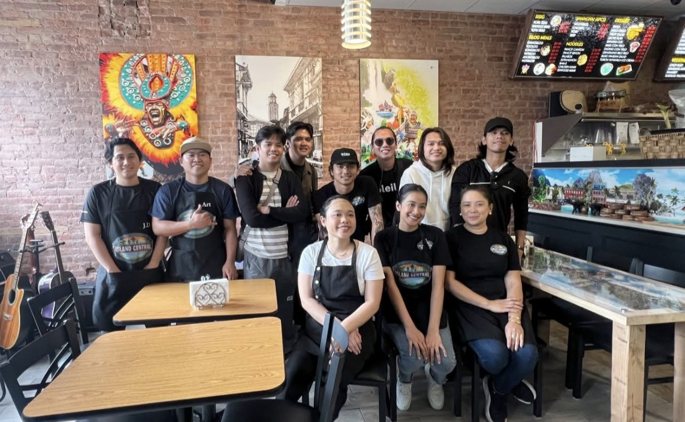
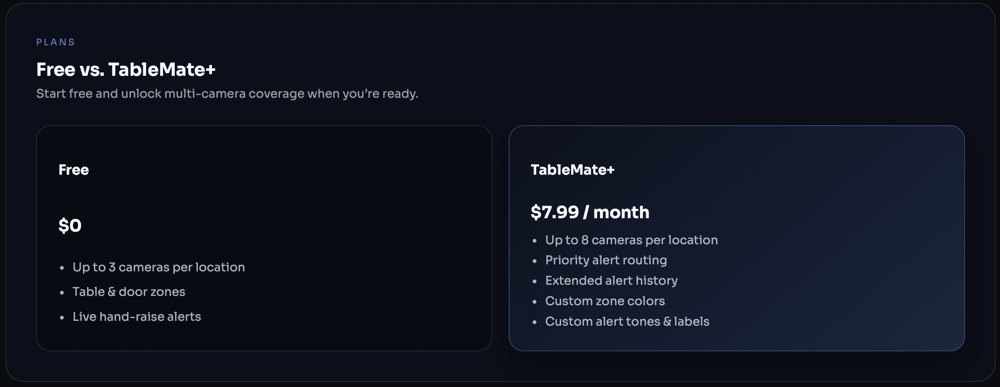
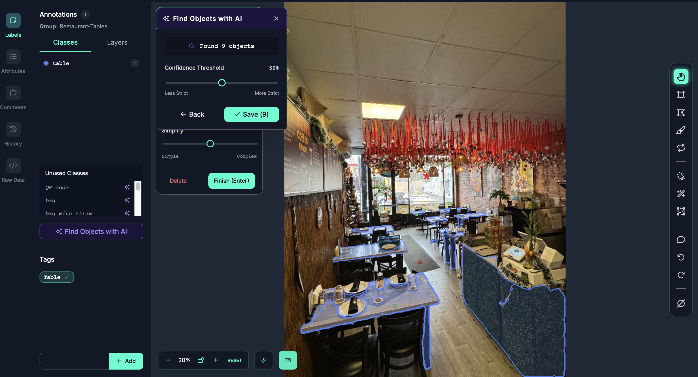
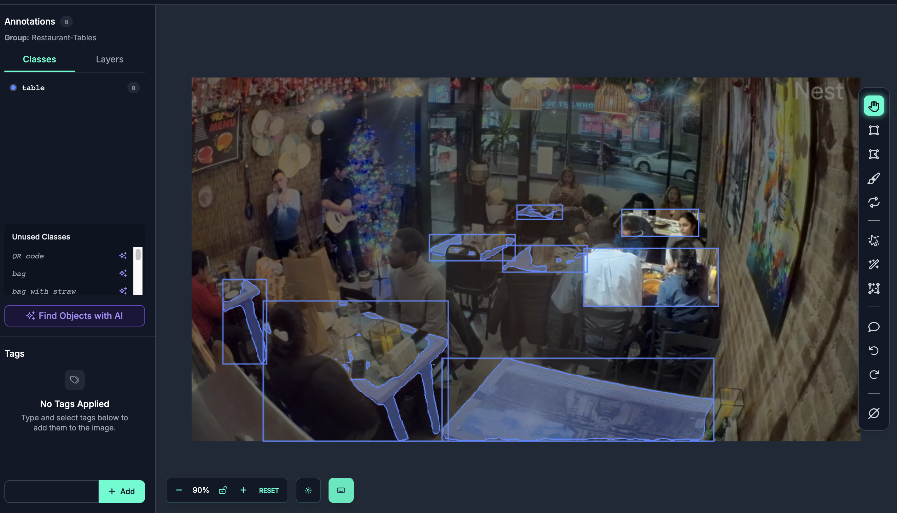

# TableMate x Github
Discover a new way to manage your business.

  

 **Report Issues/Feature Requests:** https://github.com/pokecedgo/TableMate/discussions

 **TableMate:** https://tablemate.work

---
## TableMate Story

  
  

While dining in the corner of a small restaurant in Jersey, I watched the space go from empty into a full
house - over 30 people packed into a tight floor. Like many busy small businesses, this
restaurant was experiencing a major rush while trying to maximize profits by juggling
dine-in service alongside multiple delivery platforms. I happened to be seated near the
delivery pickup area and quickly noticed something striking: only two employees were
managing everything. They were serving tables, preparing online orders, and coordinating
with delivery drivers all at once. Drivers waited for food, customers stood at the register
making eye contact for five minutes or more, and tables needed attention - not because the
staff didn't care, but because they simply couldn't see everything at once. That moment
revealed a common challenge for modern small businesses operating at full capacity.
TableMate was born from that realization: a virtual second set of eyes designed to help
teams stay aware, responsive, and efficient during peak moments.

## V1 (Beta) Update Log
- Multi-camera monitoring with per-camera zones
- Table and door zones for in-restaurant coverage
- Hand-gesture detection for customer assistance alerts
- People counting and live alert feed
- Table management timers for dine-in tracking
- Room control for staff device coordination
- Owner + employee views with real-time updates

## Initial Project Design
https://drive.google.com/file/d/1JVNOImLmwKWfekDwv7iN0JJCTQchAh33/view?usp=share_link

## Why use TableMate in your business?
---
Need a bathroom break? TableMate keeps watch and alerts you the moment someone walks in using our ** Room Feature.** A way to connect any amount of devices, whether a work tablet or your personal phone, to the TableMate application.

Busy rush with and the business is getting orders from UberEats & Doordash but there's only 2 employees on the floor? TableMate flags **hand‑raise detection** help customers be priotized at all times so no table gets missed and your business maintains that high rating review!

Working the register while delivery pickups pile up? TableMate helps you prioritize who needs you next and alerts customers that enters/leaves the door with **Door Detection**.

Blind spots in the dining room and don't want to risk customers waiting too long? TableMate covers the areas you can’t see from the counter. Use TableMate's **Dine Tracker** to track how long customers have been dining.

---
## Documentation Outline (Coming Soon)

## Recommended Camera Setup
(TableMate allows usage of 1 Camera up to 8 Cameras)
- **Single camera setup:** Mount the camera in a high, fixed position with a wide view of the dining floor. Aim to capture every table clearly with minimal obstructions.
- **Multiple rooms or blocked sightlines:** If walls or layout prevent one camera from seeing all tables, add additional cameras. Each camera can have its own zone setup so every area is covered.
- **Avoid blind spots:** Check corners, booths, and areas behind partitions. If a table can’t be seen clearly, add a second angle.
- **Stable placement:** Use a fixed mount (tripod, wall mount, shelf) to prevent the camera from shifting during busy hours.
- **Lighting matters:** Place cameras where lighting is consistent and avoid direct glare from windows or overhead lights to improve detection accuracy.

## Zone Creation (How To)

## Room Creation (How To)

## Free Vs. TableMate+

## Management Mode

## Alerts & Notifications

## Settings
---

### Architecture

### Backend API

## Resources
- Ultralytics YOLO: https://docs.ultralytics.com
- Roboflow: https://roboflow.com
- Driver.js (guided tours): https://driverjs.com
- Firebase: https://firebase.google.com
- Fly.io: https://fly.io

---
## Custom Trained Models: Few Samples
Camera used for training: EMEET SmartCam w/ Tripod 
 
 
