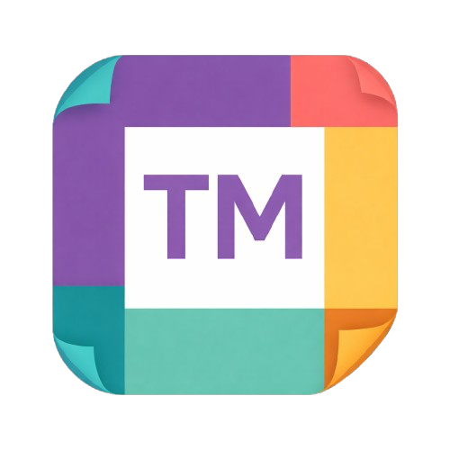

# TableMate

## Story of TableMate

While dining in the corner of a small restaurant, I watched the space transform into a full
house - over 30 people packed into a tight floor. Like many busy small businesses, this
restaurant was experiencing a major rush while trying to maximize profits by juggling
dine-in service alongside multiple delivery platforms. I happened to be seated near the
delivery pickup area and quickly noticed something striking: only two employees were
managing everything. They were serving tables, preparing online orders, and coordinating
with delivery drivers all at once. Drivers waited for food, customers stood at the register
making eye contact for five minutes or more, and tables needed attention - not because the
staff didn't care, but because they simply couldn't see everything at once. That moment
revealed a common challenge for modern small businesses operating at full capacity.
TableMate was born from that realization: a virtual second set of eyes designed to help
teams stay aware, responsive, and efficient during peak moments.

## V1 (Beta) Update Log
- Multi-camera monitoring with per-camera zones
- Table and door zones for in-restaurant coverage
- Hand-gesture detection for customer assistance alerts
- People counting and live alert feed
- Table management timers for dine-in tracking
- Room control for staff device coordination
- Owner + employee views with real-time updates

## Documentation Outline (Coming Soon)
### Architecture

### Backend API

### QnA (TableMate Usage)
## Camera Setup

## Zone Creation

## Room Creation

## Free Vs. TableMate+

## Management Mode

### Alerts & Notifications

### Initial Project Design

### Project Architecture 

## Resources
- Ultralytics YOLO: https://docs.ultralytics.com
- Driver.js (guided tours): https://driverjs.com
- Firebase: https://firebase.google.com
- Fly.io: https://fly.io
